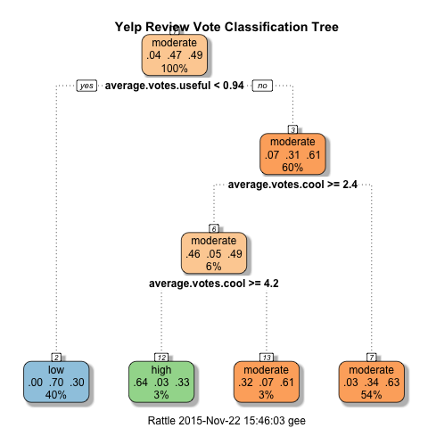

Making Yelp Reviews Valuable to Readers?
========================================================
author: gengelbeck
date: 22 November 2015

Introduction
========================================================

Yelp allows readers to rate reviews as useful, funny, or cool.

**Goals**
- What predicts reader votes for reviews?
- How can review writers get more votes?

**Advice to writers**
- First: *Be informative*
- Second:*Be cool*

Methods
========================================================

[*Yelp Academic Dataset*](http://www.yelp.com/dataset_challenge) - contains reviews, business, and user data from Yelp for four cities. (1.6M reviews and 500K tips by 366K users for 61K businesses)

Categorized review votes in to three categories: 

  - **low** - reviews receiving no votes (47% of the reviews), 
  - **moderate** - reviews receiving between 1 and 9 votes (49% of the reviews), and 
  - **high** - reviews receiving 10 or more votes (4% of the reviews).
  
Trained a tree model to predict reader votes for Yelp reviews

Results
========================================================
A tree model was created that correctly predicted 65 percent of *low*, *moderate*, and *high* voted reviews.

Discussion
========================================================

**Advice to writers**
- Note: The predictors are about the writing (not the business or the reviewer)
- First: *Be informative*
- Second:*Be cool*

**Next steps**
- Understand what distinguishes *cool reviews* from other reviews. 
- Seek a better way to model data with a vast number of zeros and a wide range of values.

